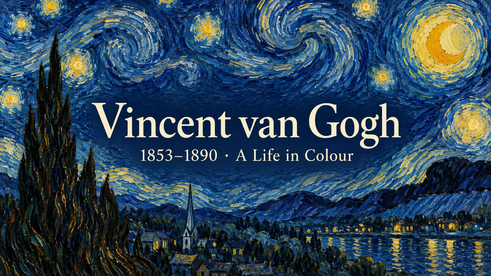

# 梵高的 3D 简历 · Van Gogh 3D Resume

由乐之用 AI 辅助改编的互动艺术家主页：让梵高从画面里走出来，用一份会动的 3D 简历介绍他的艺术人生。



## 体验亮点

- **眼神与头部跟随鼠标**：左右转头、抬头低头，适合录屏演示。
- **自然眨眼与轻微呼吸**：保留卡通人物的风格，点击人物可轻轻点头。
- **蓝色星空背景**：星月夜风格的艺术再创作，搭配手写标题。
- **滚动探索艺术人生**：从荷兰、巴黎、阿尔勒到圣雷米与奥维尔。
- **代表作品画廊**：展示《吃土豆的人》《向日葵》《卧室》《星月夜》《盛开的杏花》，附馆藏来源。
- 适配电脑与手机；尊重系统“减少动态效果”设置。

本项目是风格化艺术展示，不是梵高本人或博物馆官方网站，也不是 AI 对话机器人。

## 本地运行

需要 Node.js 22.13+（或更高受支持版本）与 npm。在项目目录执行：

```bash
cd web
npm ci
npm run dev
```

打开终端显示的本地网址。开发服务关闭后，本地网址也会停止访问。

```bash
npm run typecheck
npm run lint
npm run build
npm run preview
```

构建产物位于 `web/dist/`。纯前端项目，无需数据库、AI API Key 或后端服务。

## 修改内容

| 内容 | 文件 |
| --- | --- |
| 首屏简介 | `web/src/App.tsx` |
| 人生经历 | `web/src/ui/Resume.tsx` |
| 作品列表 | `web/src/data/works.ts` |
| 作品详情 | `web/src/content/works/van-gogh-*.md` |
| 人物互动 | `web/src/scene/InteractivePortrait.tsx` |
| 灯光与滚动镜头 | `web/src/scene/PersonalScene.tsx` |
| 人物模型 | `web/public/models/lezhi/avatar.glb` |
| 背景 | `web/public/images/lezhi/backgrounds/starry-night.png` |

`InteractivePortrait.tsx` 中的 `FOLLOW` 控制转头幅度与响应速度。当前眼部坐标是针对随附模型校准的；更换模型后需要重新校准，不能仅替换任意 GLB 就获得同样的表情。

## 技术栈

React · TypeScript · Vite · Three.js · React Three Fiber · Drei · Framer Motion · Zustand

## 致谢与素材说明

本项目基于 [dayinji/sen-3d-resume](https://github.com/dayinji/sen-3d-resume) 的 MIT 代码改编，保留原始 [LICENSE](LICENSE) 和 [上游版权声明](docs/UPSTREAM-NOTICE.md)。感谢原作者的开源分享。

发布版已排除原作者的人物模型、Blender 工程和品牌图片，也不包含乐之早期个人版的资料快照和作品内容。

代码许可不等于素材许可。人物、背景、字体、环境贴图和馆藏图片请分别查看 [素材说明](NOTICE.md)，不要将全部资源视为 MIT 授权素材。

## 发布说明

GitHub 仓库保存的是源码，上传仓库不等于网站已经上线。运行 `npm run build` 后可将 `web/dist/` 交给静态网站托管服务；仓库内的构建检查也会生成可下载的网站文件。

正式部署后，请把 `web/index.html` 中的社交封面图片地址改为实际网站的完整 HTTPS 地址。
